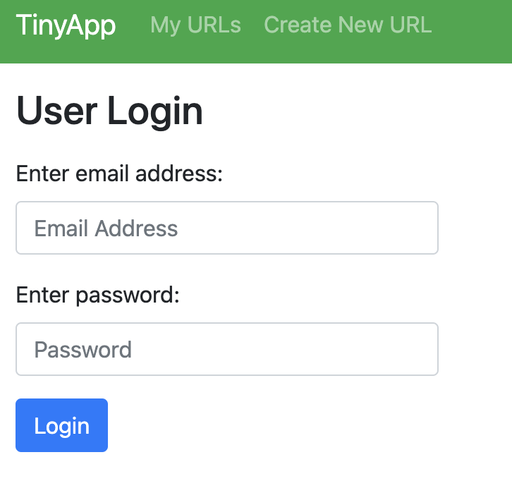
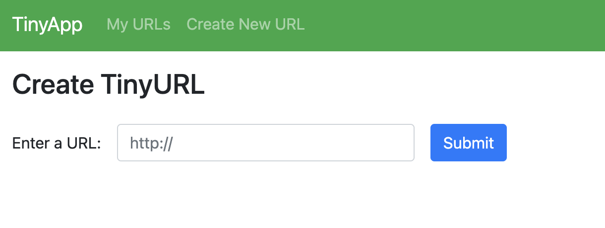

# TinyApp

Web app that allows users to shorten any long URLs to short ones.

## Getting started

1. Install using the `npm install` command
2. Start web server with `node express_server.js` command

## Screenshots

### User Login

### Register

### Create URL

